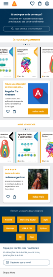
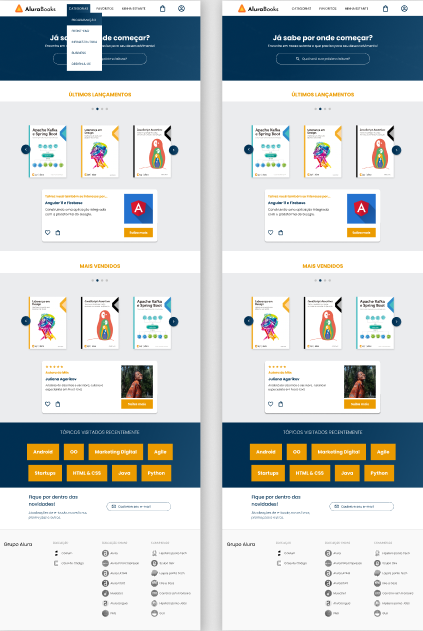
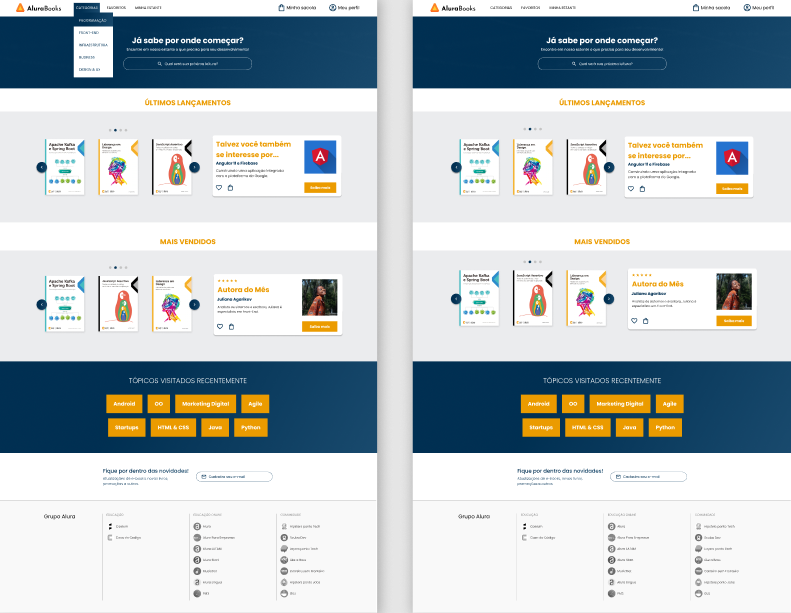

<h1 align="center"> Responsividade mobile-first - AluraBooks</h1>

 Projeto desenvolvido no curso de Responsividade mobile-first na Alura. 

  <a href="#-tecnologias">Tecnologias</a>&nbsp;&nbsp;&nbsp;|&nbsp;&nbsp;&nbsp;
  <a href="https://github.com/gabriel-adsv/alurabooks">Projeto</a>&nbsp;&nbsp;&nbsp;|&nbsp;&nbsp;&nbsp;
  <a href="https://gabriel-adsv.github.io/alurabooks/" target="_blank">Layout</a>&nbsp;&nbsp;&nbsp;|&nbsp;&nbsp;&nbsp;
  <a href="#memo-licença">Licença</a>

  

 

  
  
  

## 🚀 Tecnologias
Esse projeto foi desenvolvido para a prática de responsividade mobile-first afim de se ajustar ao seguintes tamanho de dispositivos:
- Mobile - 428px
- Tablet - 1024px
- Desktop - 1728px

## 💻 Projeto
Atividade feita no desafio proposto pela Rocketseat. 
- [Acesse o projeto finalizado, online](https://gabriel-adsv.github.io/alurabooks/)

## 📝 Licença
Esse projeto está sob a licença MIT.

---
Feito com ♥ by Gabriel Augusto